

# 프로젝트 개요

프로젝트 내용 : 무신사 랭킹 탑 100 리뷰 긍부정검사 및 체형에 맞는 사이즈 추천 
소속 : LG U+ SW camp 2기 
팀원 : 강이삭, 장은별, 정수빈 
기간 : 24.11.6 ~ 24.11.13 

 

# 맡은 역할
강이삭 : 크롤링, 백엔드, 프론트엔드, AWS 서버구축, DB 서버구축 
장은별 : 리뷰 감성분석 모델링 
정수빈 : 크롤링, 사이즈 추천 모델링

 
 

# 진행순서

1.무신사 크롤링 
2.크롤링한 데이터 DataBase에 넣기 
3.데이터 모델링(리뷰 분석, 사이즈 추천) 
4.서비스 만들기 
5.AWS배포 

# 크롤링

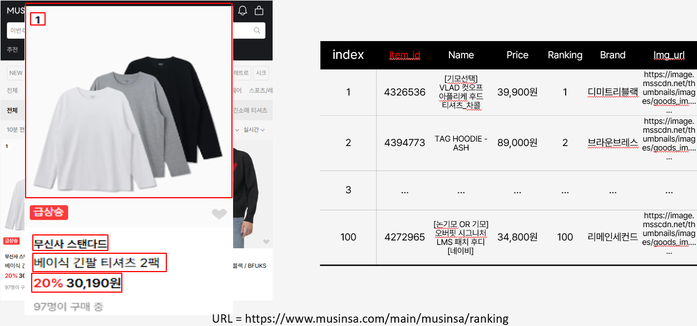 
랭킹 메인 페이지 : item_id, Name, Price, Ranking, Brand, Img_url 데이터 수집
 
 
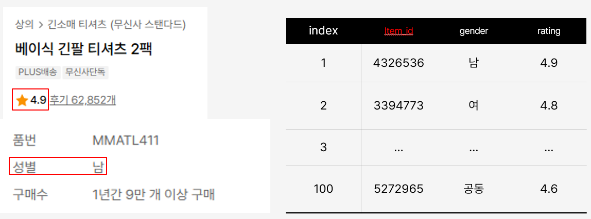 
메인페이지 에서 수집한 item_id를 통해 상세 상품 페이지로 이동 
상품 상세 페이지 : Gender, Ranking 데이터 수집
 
 
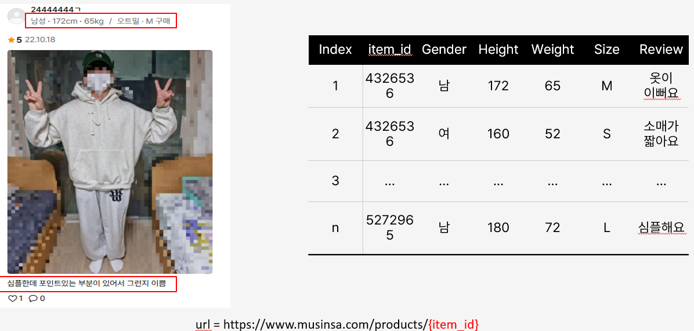 
마찬가지로 Item_id를 통해 상세 리뷰 페이지로 이동 
상품 리뷰 페이지 : Gender, Height, Weight, Size, Review 데이터 수집

# DB
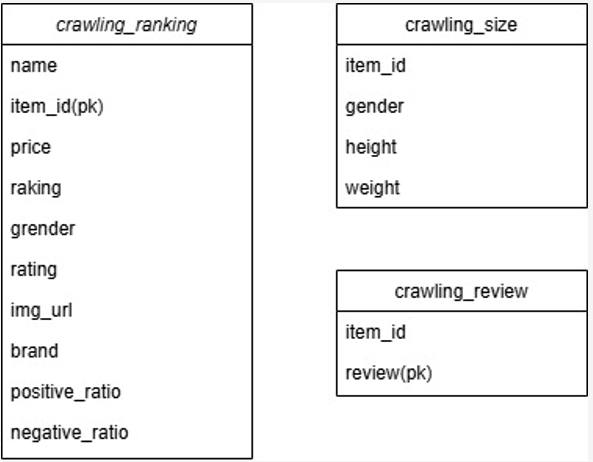

# 리뷰 분석

### 순서
1.전처리
- 정규 표현식
- 자연어 처리 

2.정수 인코딩 
3.모델 학습 
4.긍부정 분석 

### 정규 표현식
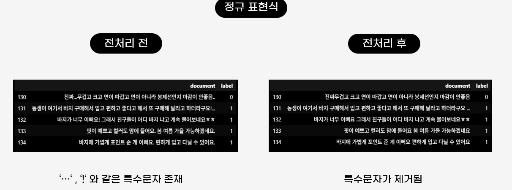 

### 자연어 처리
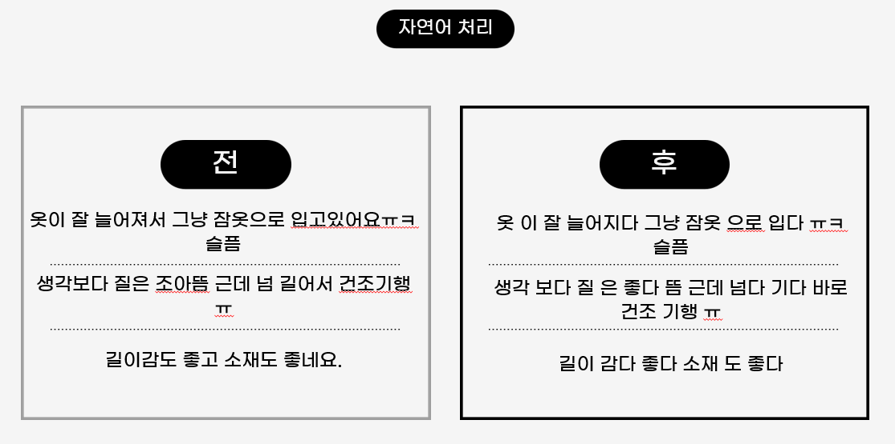 

### 정수 인코딩
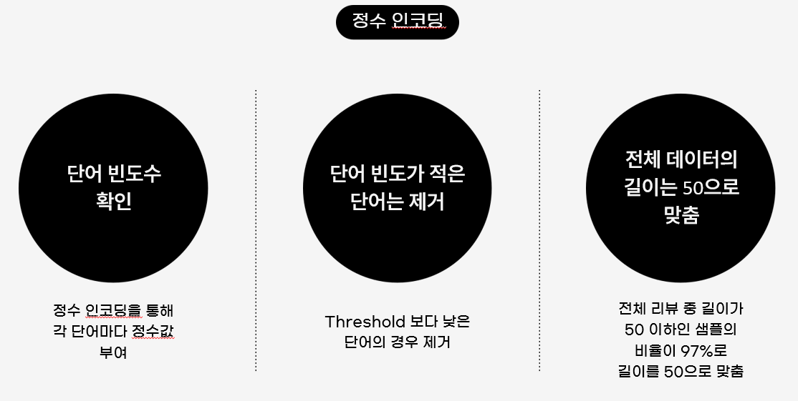 

### 모델 학습
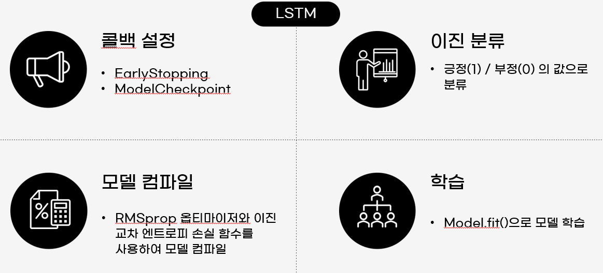 

### 긍부정 분석 (결과)
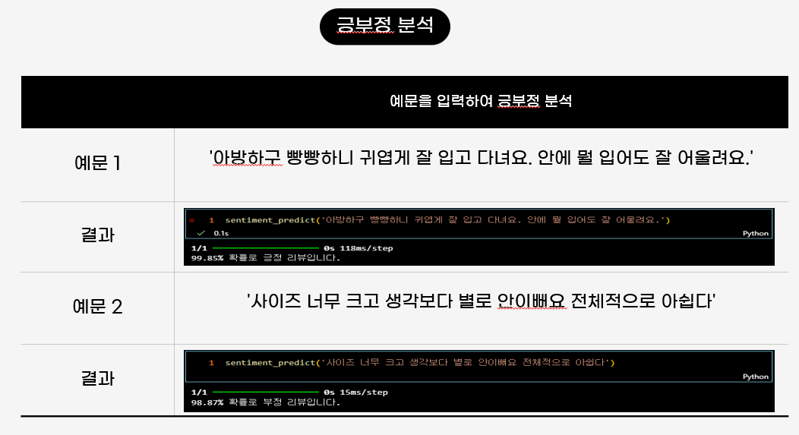 

# 사이즈 추천

### 순서

1.데이터 
2.전처리 
3.사용 모델 
- XGBOOST 

### 사용 데이터
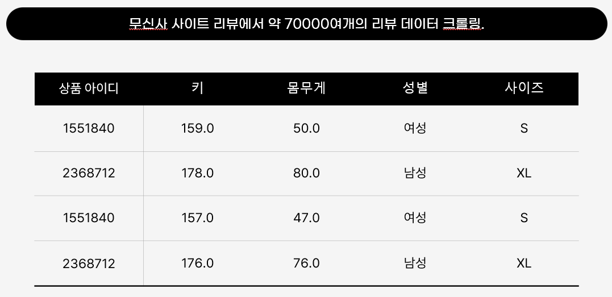 

### 전처리
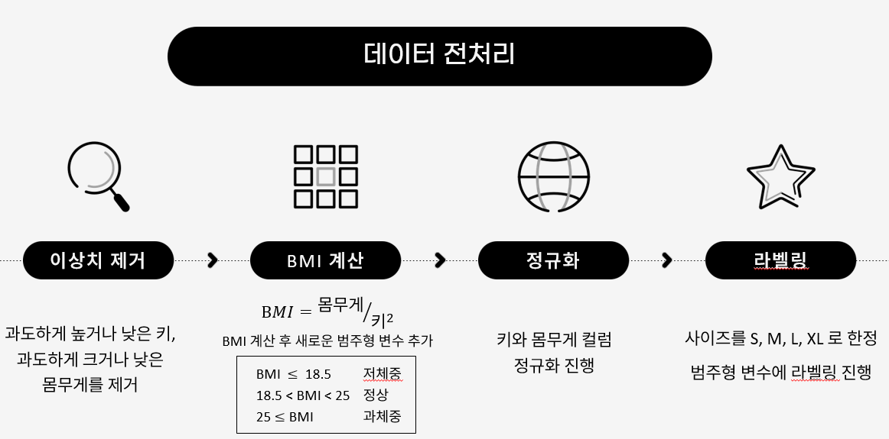 

### 사용한 모델
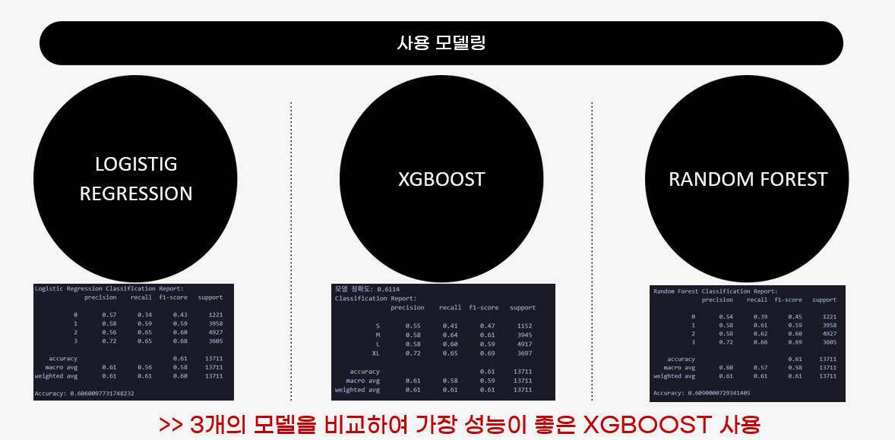 

### XGBOOST
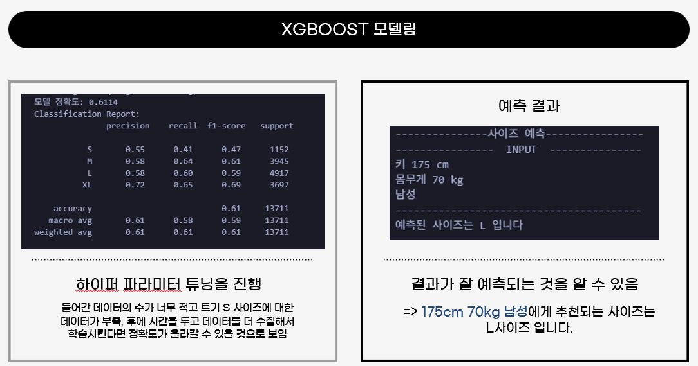 

# 서비스

### main
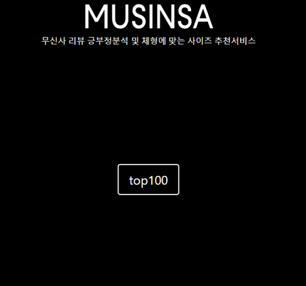 
메인 홈페이지입니다.

### Ranking
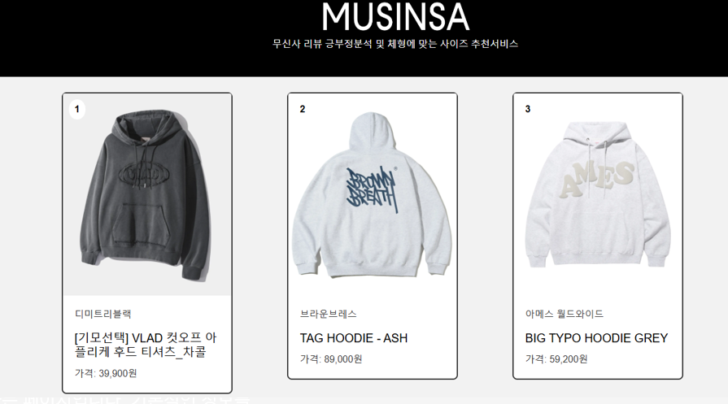 
무신사 랭킹 100의 상품들의 정보가 있습니다.
반응형으로 만들었습니다.

### Product(Detail) 
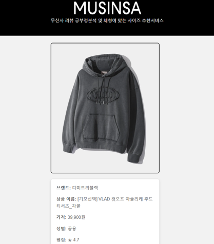

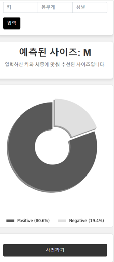 
상품의 상세 정보들이 있습니다. 
브랜드, 상품명, 가격, 성별, 평점 
사이즈 예측 
긍부정 분석결과 
사러가기버튼  

# 배포
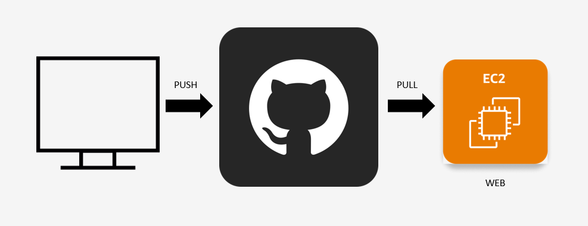 
 
EC2 로 배포 후  
Nginx-Fastapi으로 웹 배포.

# 아쉬웠던점
강이삭 : 매일 크롤링한 데이터를 삭제하고 특정 시간에 갱신을 하고 싶었는데 EC2 프리티어에서 자동으로 돌리니 성능이 안따라 줘서 못한점이 아쉬웠습니다.  
장은별 : 리뷰에 대한 긍부정 키워드를 추출하여 나타내고 싶었는데 못해서 아쉬웠습니다.  
정수빈 : 시간이 부족해서 데이터 수집을 많이 못했습니다.  그래서 정확도가 높게 측정이 안돼서 아쉬웠습니다. 
